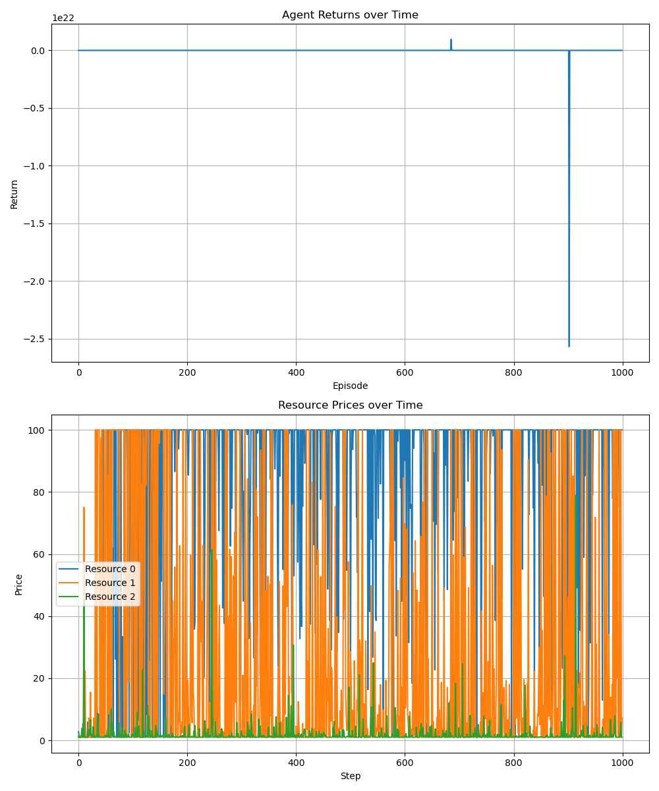
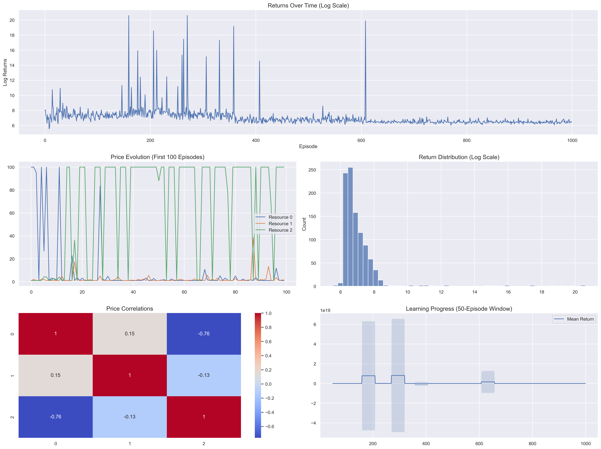
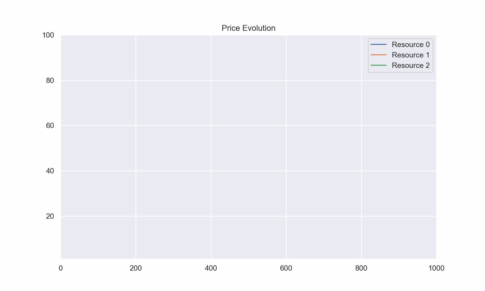

# Multi-Agent RL Trading System

This is a reinforcement learning framework for training agents to trade in simulated markets using PPO or Proximal Policy Optimization!



## Overview

- a multi agent environment simulating market dynamics
- PPO implementation for continuous action spaces
- price impact modeling and portfolio management!
- a visualization suite

## Results

the agent learns stable trading strategies:



some key findings are that:
- returns stabilize around 3 million after initial exploration
- theres a price correlation that shows market impact understanding
- looks like the agent adapts to market volatility

## Some Technical Details

### Environment Performance


### Environment
- custom OpenAI gym environment
- 3 tradeable resources
- orice impact modeling
- portfolio tracking

### Agent Architecture
- an actor critic network
- PPO with continuous actions
- moving window advantage estimation
- an experience replay!

## Installation
```bash
git clone https://github.com/yourusernameheh/marl-trading.git
cd marl-trading
python -m venv venv
source venv/bin/activate
pip install -r requirements.txt
```

## Usage
```python
python train.py  #to train the agent
```

in `notebooks/analysis.ipynb` there's performance analysis info
